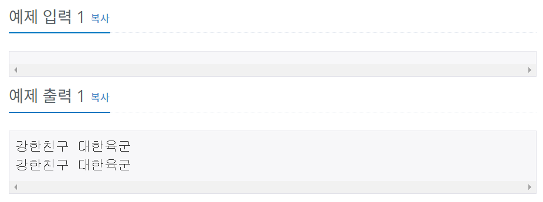

# 백준 10718번 파이썬


## 문제

ACM-ICPC 인터넷 예선, Regional, 그리고 World Finals까지 이미 2회씩 진출해버린 kriii는 미련을 버리지 못하고 왠지 모르게 올해에도 파주 World Finals 준비 캠프에 참여했다.

대회를 뜰 줄 모르는 지박령 kriii를 위해서 격려의 문구를 출력해주자.


## 입력

없음


## 출력

두 줄에 걸쳐 "강한친구 대한육군"을 한 줄에 한 번씩 출력한다.


## 예제 입력




## **문제 풀이**


```python
print("강한친구 대한육군")
print("강한친구 대한육군")
```

print 문을 2번 사용하여 출력하는 방법도 있지만


```python
print("강한친구 대한육군\n"*2)
```

print(" "*2)를 사용하여 2번 출력하는 방법도 있다.

