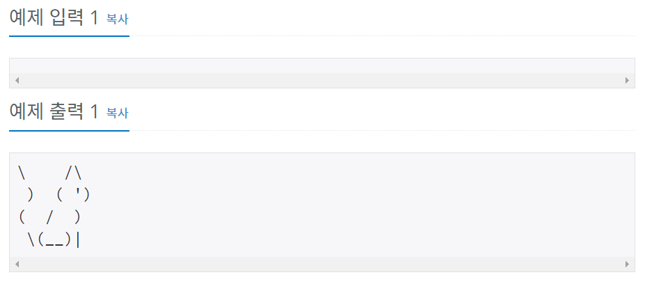

# 백준 10171번 파이썬


## 문제

아래 예제와 같이 고양이를 출력하시오.


## 입력

없음


## 출력

고양이를 출력한다.


## 예제 입력




## **문제 풀이**


```python
print("\\    /\\")
print(" )  ( ')")
print("(  /  )")
print(" \\(__)|")
```


\\(역슬래시)를 출력하기 위해서는 \\(역슬래시)를 연속으로 2번 써야 한다. 