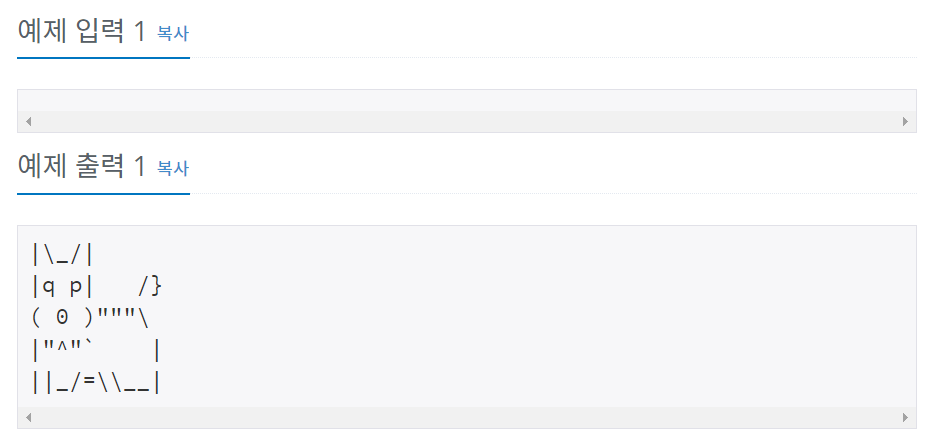

# 백준 10172번 파이썬


## 문제

아래 예제와 같이 개를 출력하시오.


## 입력

없음


## 출력

개를 출력한다.


## 예제 입력




## **문제 풀이**


```python
print("|\\_/|")
print("|q p|   /}")
print("( 0 )\"\"\"\\")
print("|\"^\"`    |")
print("||_/=\\\\__|")
```

이스케이프 문자(", ', \\)를 출력하기 위해서는 앞에 \를 붙여야 한다.

