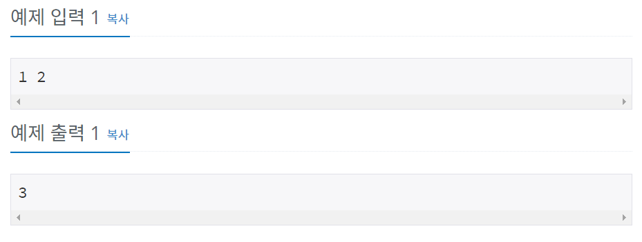

# 백준 1000번 파이썬


## 문제

두 정수 A와 B를 입력받은 다음, A+B를 출력하는 프로그램을 작성하시오.


## 입력

첫째 줄에 A와 B가 주어진다. (0 < A, B < 10)


## 출력

첫째 줄에 A+B를 출력한다.


## 예제 입력




**문제 풀이**


```python
a, b = map(int, input().split())
print(a+b)
```

map() 함수를 통하여 반복 가능한 자료형을 입력 받고, split을 통하여 공백을 기준으로 입력 받는 값을 나눠주었다.


map() 함수는 여러 값을 받을 때 유용한 함수이다.