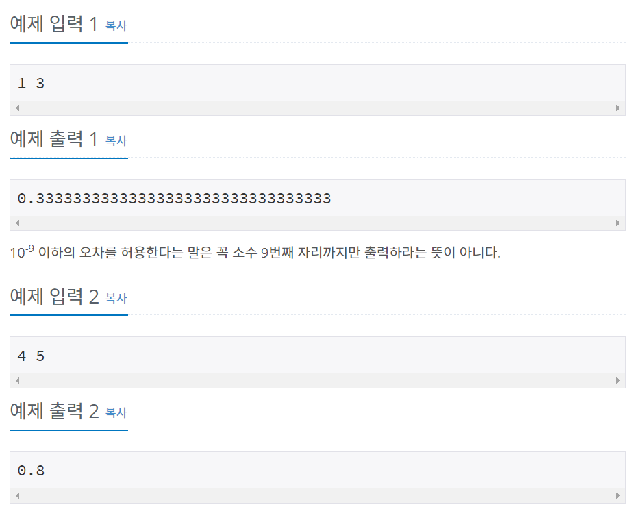

# 백준 1008번 파이썬


## 문제

두 정수 A와 B를 입력받은 다음, A / B를 출력하는 프로그램을 작성하시오.


## 입력

첫째 줄에 A와 B가 주어진다. (0 < A, B < 10)


## 출력

첫째 줄에 A/B를 출력한다. 실제 정답과 출력값의 절대오차 또는 상대오차가 
$$
1/10^9
$$
이하이면 정답이다.


## 예제 입력




## **문제 풀이**


```python
a, b = map(int, input().split())
print(a/b)
```

백준 1000번 문제와 동일하게 map함수로 여러 값을 입력 받은 후 a/b를 사용하여 소수점까지 print한다.