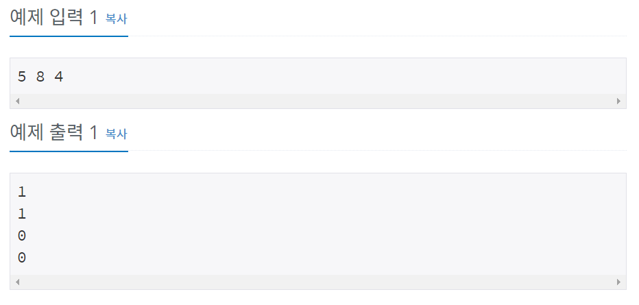

# 백준 10430번 파이썬


## 문제

(A+B)%C는 ((A%C) + (B%C))%C 와 같을까?

(A×B)%C는 ((A%C) × (B%C))%C 와 같을까?

세 수 A, B, C가 주어졌을 때, 위의 네 가지 값을 구하는 프로그램을 작성하시오.


## 입력

첫째 줄에 A, B, C가 순서대로 주어진다. (2 ≤ A, B, C ≤ 10000)


## 출력

첫째 줄에 (A+B)%C, 둘째 줄에 ((A%C) + (B%C))%C, 셋째 줄에 (A×B)%C, 넷째 줄에 ((A%C) × (B%C))%C를 출력한다.


## 예제 입력



## **문제 풀이**


```python
a, b, c = map(int, input().split())
print((a+b)%c)
print(((a%c) + (b%c))%c)
print((a*b)%c)
print(((a%c) * (b%c))%c)
```

map함수로 a, b, c의 값을 입력 받은 후 (A+B)%C, 둘째 줄에 ((A%C) + (B%C))%C, 셋째 줄에 (A×B)%C, 넷째 줄에 ((A%C) × (B%C))%C을 차례대로 출력한다. 여기서 x(곱하기)는 파이썬에서 *이다.