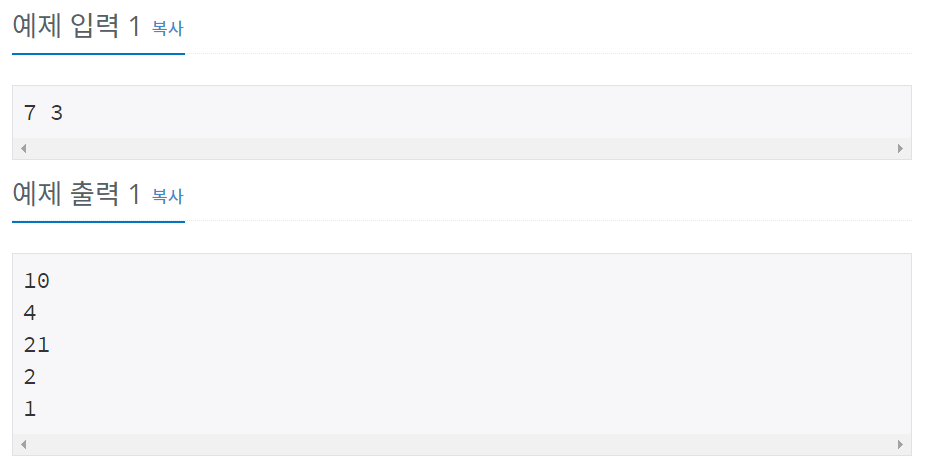

# 백준 10869번 파이썬


## 문제

두 자연수 A와 B가 주어진다. 이때, A+B, A-B, A*B, A/B(몫), A%B(나머지)를 출력하는 프로그램을 작성하시오. 


## 입력

두 자연수 A와 B가 주어진다. (1 ≤ A, B ≤ 10,000)


## 출력

첫째 줄에 A+B, 둘째 줄에 A-B, 셋째 줄에 A*B, 넷째 줄에 A/B, 다섯째 줄에 A%B를 출력한다.


## 예제 입력




## **문제 풀이**


```python
a, b = map(int, input().split())

print(a+b)
print(a-b)
print(a*b)
print(a//b)
print(a%b)
```

map함수로 a, b의 값을 입력 받은 후 A+B, A-B, A*B, A/B(몫), A%B(나머지)을 차례로 출력하는데 /를 쓰면 소수점까지 나오기 때문에  //를 써서 정수 몫을 출력한다.