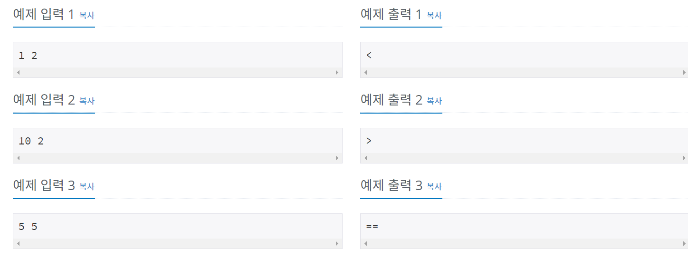

# 백준 1330번 파이썬


## 문제

두 정수 A와 B가 주어졌을 때, A와 B를 비교하는 프로그램을 작성하시오.


## 입력

첫째 줄에 A와 B가 주어진다. A와 B는 공백 한 칸으로 구분되어져 있다.


## 출력

첫째 줄에 다음 세 가지 중 하나를 출력한다.

- A가 B보다 큰 경우에는 '`>`'를 출력한다.
- A가 B보다 작은 경우에는 '`<`'를 출력한다.
- A와 B가 같은 경우에는 '`==`'를 출력한다.


## 예제 입력




## **문제 풀이**


```python
a,b = map(int,input().split())

if(a>b):
	print('>')
if(a<b):
	print("<")
if(a==b):
	print("==")
```

a,b의 값을 map함수를 통하여 입력받은 후 각 if문을 통하여 비교 후 출력한다.