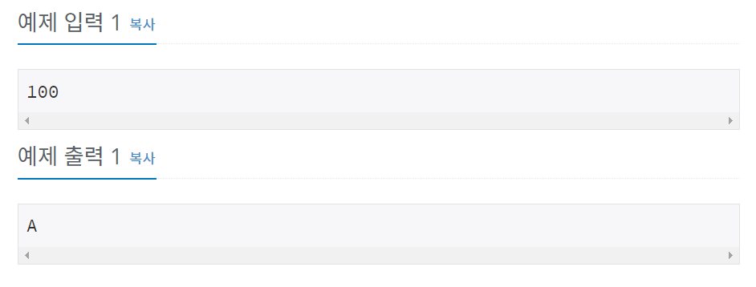

# 백준 9498번 파이썬


## 문제

시험 점수를 입력받아 90 ~ 100점은 A, 80 ~ 89점은 B, 70 ~ 79점은 C, 60 ~ 69점은 D, 나머지 점수는 F를 출력하는 프로그램을 작성하시오.


## 입력

첫째 줄에 시험 점수가 주어진다. 시험 점수는 0보다 크거나 같고, 100보다 작거나 같은 정수이다.


## 출력

시험 성적을 출력한다.


## 예제 입력



## **문제 풀이**


```python
a = int(input())

if (a<=100 and a>=90) :
	print("A")
	
elif (a<90 and a>=80) :
	print("B")
	
elif (a<80 and a>=70) :
	print("C")

elif (a<70 and a>=60) :
	print("D")
else :
	print("F")
```

a라는 변수로 시험 점수를 입력 받은 후 if, elif, else문을 활용하여 각 알파벳을 출력하였다. elif 대신 if로 작성할 경우 각각 조건의 해당하는 알파벳이 모두 출력되기 때문에 elif로 작성을 해야한다.

