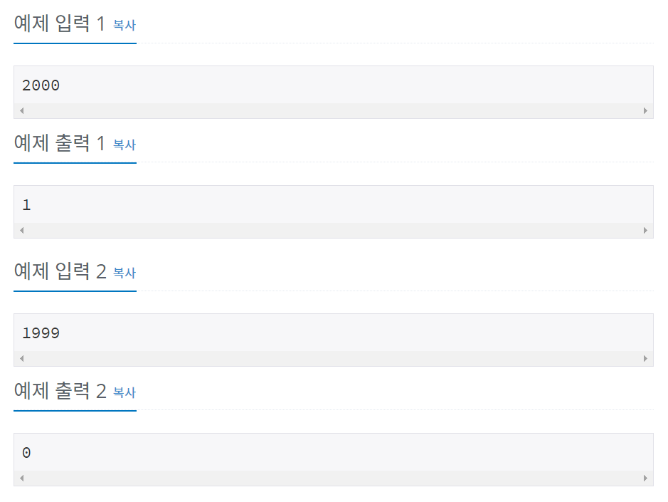

# 백준 2753번 파이썬


## 문제

연도가 주어졌을 때, 윤년이면 1, 아니면 0을 출력하는 프로그램을 작성하시오.

윤년은 연도가 4의 배수이면서, 100의 배수가 아닐 때 또는 400의 배수일 때이다.

예를 들어, 2012년은 4의 배수이면서 100의 배수가 아니라서 윤년이다. 1900년은 100의 배수이고 400의 배수는 아니기 때문에 윤년이 아니다. 하지만, 2000년은 400의 배수이기 때문에 윤년이다.


## 입력

첫째 줄에 연도가 주어진다. 연도는 1보다 크거나 같고, 4000보다 작거나 같은 자연수이다.


## 출력

첫째 줄에 윤년이면 1, 아니면 0을 출력한다.


## 예제 입력



## **문제 풀이**


```python
a = int(input())

if (a%4 == 0):
	
	if((a%100 != 0) or (a%400 ==0)):
			print("1")
	else :
			print("0")

else :
	print("0")
```

a라는 변수로 년도를 입력 받은 후 if문 안에 if문을 작성하여 4의 배수이면서, 100의 배수가 아닐 때 또는 400의 배수일 때 1을 출력하도록 하였고, 그 이외는 0을 출력하도록 하였다.

