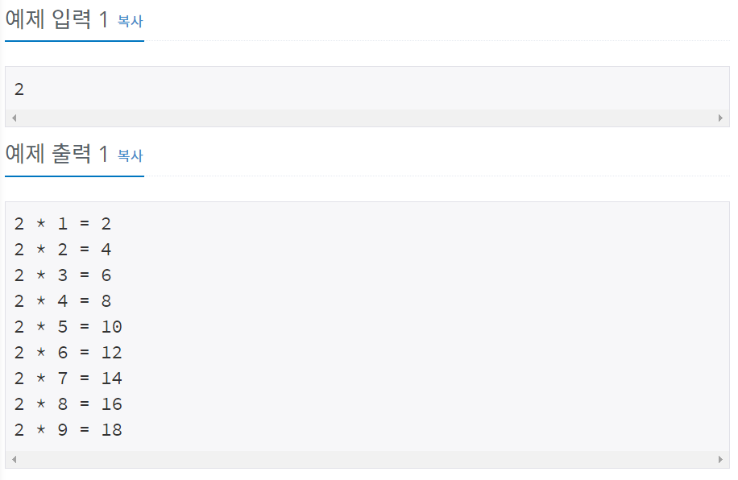

# 백준 2739번 파이썬


## 문제


N을 입력받은 뒤, 구구단 N단을 출력하는 프로그램을 작성하시오. 출력 형식에 맞춰서 출력하면 된다.

## 입력

첫째 줄에 N이 주어진다. N은 1보다 크거나 같고, 9보다 작거나 같다.


## 출력

출력형식과 같게 N*1부터 N*9까지 출력한다.


## 예제 입력



## **문제 풀이**


```python
n = int(input())

for i in range(1,10): 
	multiply = n * i
	print(n,"*",i,"=",multiply)
    
```

n 값을 입력 받은 후 for 문을 통하여 1부터 9(10-1)까지 반복하여 구구단을 출력한다.

n, i, multiply는 int형이기 때문에 문자열과 같이 쓰기 위하여 콤마(,)를 사용하여 print하였다.