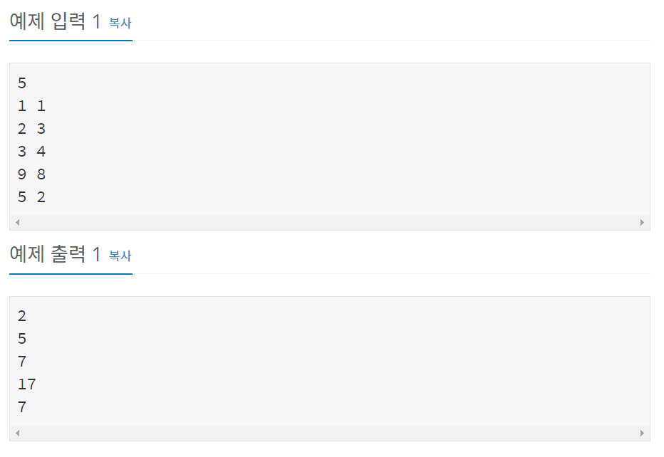

# 백준 10950번 파이썬


## 문제

두 정수 A와 B를 입력받은 다음, A+B를 출력하는 프로그램을 작성하시오.


## 입력

첫째 줄에 테스트 케이스의 개수 T가 주어진다.

각 테스트 케이스는 한 줄로 이루어져 있으며, 각 줄에 A와 B가 주어진다. (0 < A, B < 10)


## 출력

각 테스트 케이스마다 A+B를 출력한다.


## 예제 입력



## **문제 풀이**


```python
n = int(input())

for i in range(1,n+1):
	a,b = map(int, input().split())
	print(a+b)
    
```

n으로 테스트 케이스의 갯수를 입력받은 후, for 문으로 n번  a, b를 입력받고 a+b를 프린트하였다.

