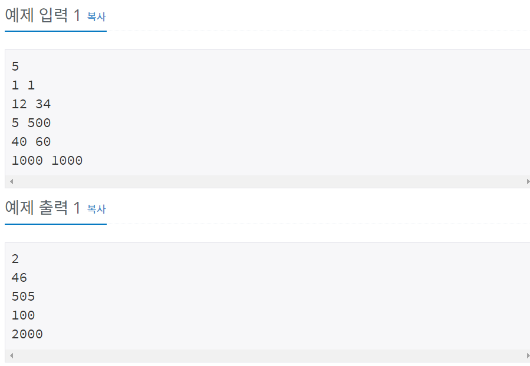

# 백준 15552번 파이썬


## 문제

본격적으로 for문 문제를 풀기 전에 주의해야 할 점이 있다. 입출력 방식이 느리면 여러 줄을 입력받거나 출력할 때 시간초과가 날 수 있다는 점이다.

C++을 사용하고 있고 `cin`/`cout`을 사용하고자 한다면, `cin.tie(NULL)`과 `sync_with_stdio(false)`를 둘 다 적용해 주고, `endl` 대신 개행문자(`\n`)를 쓰자. 단, 이렇게 하면 더 이상 `scanf`/`printf`/`puts`/`getchar`/`putchar` 등 C의 입출력 방식을 사용하면 안 된다.

Java를 사용하고 있다면, `Scanner`와 `System.out.println` 대신 `BufferedReader`와 `BufferedWriter`를 사용할 수 있다. `BufferedWriter.flush`는 맨 마지막에 한 번만 하면 된다.

Python을 사용하고 있다면, `input` 대신 `sys.stdin.readline`을 사용할 수 있다. 단, 이때는 맨 끝의 개행문자까지 같이 입력받기 때문에 문자열을 저장하고 싶을 경우 `.rstrip()`을 추가로 해 주는 것이 좋다.

또한 입력과 출력 스트림은 별개이므로, 테스트케이스를 전부 입력받아서 저장한 뒤 전부 출력할 필요는 없다. 테스트케이스를 하나 받은 뒤 하나 출력해도 된다.

자세한 설명 및 다른 언어의 경우는 [이 글](http://www.acmicpc.net/board/view/22716)에 설명되어 있다.

[이 블로그 글](http://www.acmicpc.net/blog/view/55)에서 BOJ의 기타 여러 가지 팁을 볼 수 있다.

## 입력

첫 줄에 테스트케이스의 개수 T가 주어진다. T는 최대 1,000,000이다. 다음 T줄에는 각각 두 정수 A와 B가 주어진다. A와 B는 1 이상, 1,000 이하이다.


## 출력

각 테스트케이스마다 A+B를 한 줄에 하나씩 순서대로 출력한다.


## 예제 입력



## **문제 풀이**


**잘못된 풀이**

```python
n = int(input())

for i in range(1,n+1):
		a,b = map(int, sys.stdin.readline().split())
		print(a+b)
    
```

처음에 sys.stdin.readline()을 사용하라고 해서 input 대신에 작성해서 제출하였는데 런타임 에러가 나왔다. 고민하던 중에 무언가 놓친 부분을 발견하였다. 그래서 다시 코드를 작성하였다.


**올바른 풀이**

```python
n = int(input())
import sys

for i in range(1,n+1):
		a,b = map(int, sys.stdin.readline().split())
		print(a+b)
```

sys.stdin.readline()을 사용하려면 sys를 포함하겠다는 import sys을 작성하여야 한다.


