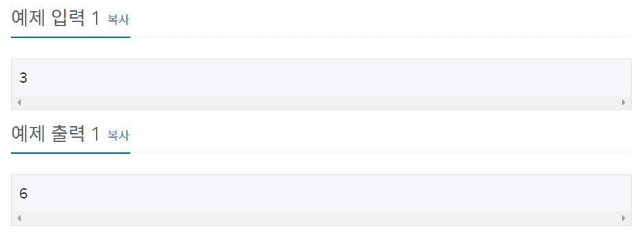

# 백준 8393번 파이썬


## 문제

n이 주어졌을 때, 1부터 n까지 합을 구하는 프로그램을 작성하시오.


## 입력

첫째 줄에 n (1 ≤ n ≤ 10,000)이 주어진다.


## 출력

1부터 n까지 합을 출력한다.


## 예제 입력



## **문제 풀이**


```python
n = int(input())
sum = 0

for i in range(1,n+1):
		sum +=i
		
print(sum)
    
```

n을 입력받은 후 for문을 1부터 n까지 돌려 sum에 계속해서 더하고 

for문이 끝난 후 sum 값을 출력하였다.