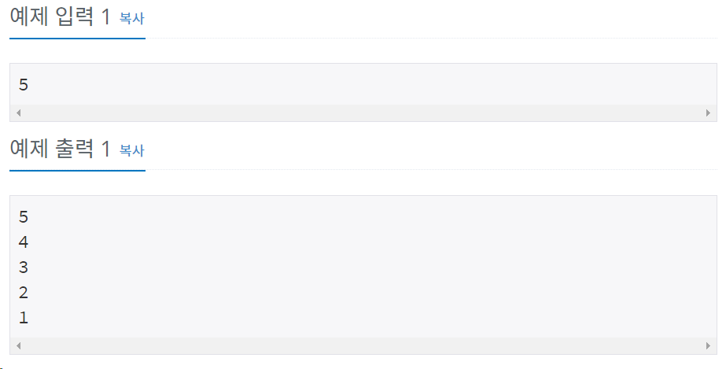

# 백준 2742번 파이썬


## 문제

자연수 N이 주어졌을 때, N부터 1까지 한 줄에 하나씩 출력하는 프로그램을 작성하시오.

## 입력

첫째 줄에 100,000보다 작거나 같은 자연수 N이 주어진다.


## 출력

첫째 줄부터 N번째 줄 까지 차례대로 출력한다.


## 예제 입력



## **문제 풀이**

```python
n = int(input())

for i in range(1,n+1):
		print(n+1-i)
```

n 값을 입력받은 후 for문을 통하여 1부터 n까지 돌리는데 역순으로 출력하기 위하여 n+1-i을 사용하여 역순으로 출력하였다.


