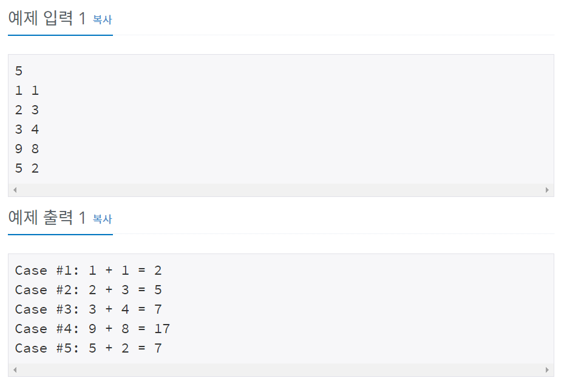

# 백준 11022번 파이썬


## 문제

두 정수 A와 B를 입력받은 다음, A+B를 출력하는 프로그램을 작성하시오.

## 입력

첫째 줄에 테스트 케이스의 개수 T가 주어진다.

각 테스트 케이스는 한 줄로 이루어져 있으며, 각 줄에 A와 B가 주어진다. (0 < A, B < 10)


## 출력

각 테스트 케이스마다 "Case #x: A + B = C" 형식으로 출력한다. x는 테스트 케이스 번호이고 1부터 시작하며, C는 A+B이다.


## 예제 입력



## **문제 풀이**

```python
n = int(input())

for i in range(1,n+1):
		a,b = map(int, input().split())		
		print("Case #"+str(i)+":",a,"+",b,"=",a+b)
```

n 값을 입력받은 후 for문을 통하여 a, b의 값을 입력받고 출력하는데 여기서 i가 정수형이므로 str(i)을 통하여 문자형으로 바꾸어 출력한다. 


