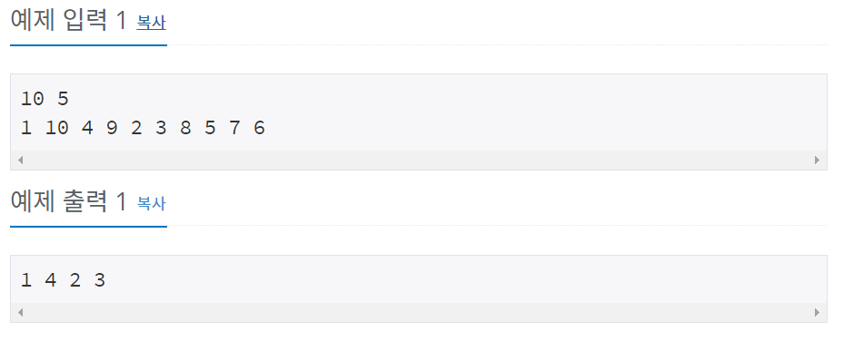

# 백준 10871번 파이썬


## 문제

정수 N개로 이루어진 수열 A와 정수 X가 주어진다. 이때, A에서 X보다 작은 수를 모두 출력하는 프로그램을 작성하시오.

## 입력

첫째 줄에 N과 X가 주어진다. (1 ≤ N, X ≤ 10,000)

둘째 줄에 수열 A를 이루는 정수 N개가 주어진다. 주어지는 정수는 모두 1보다 크거나 같고, 10,000보다 작거나 같은 정수이다.


## 출력

X보다 작은 수를 입력받은 순서대로 공백으로 구분해 출력한다. X보다 작은 수는 적어도 하나 존재한다.


## 예제 입력



## **문제 풀이**

```python
n, x = map(int, input().split())
a = list(map(int, input().split()))

for i in range(n):
	if a[i] < x :
		print(a[i],end=" ")
```

a의 값을 리스트로 만들고 for문으로 정수 n개만큼 반복되게 한다. 차례대로 x값과 비교한 뒤 작으면 a[i] 값을 출력한다.


