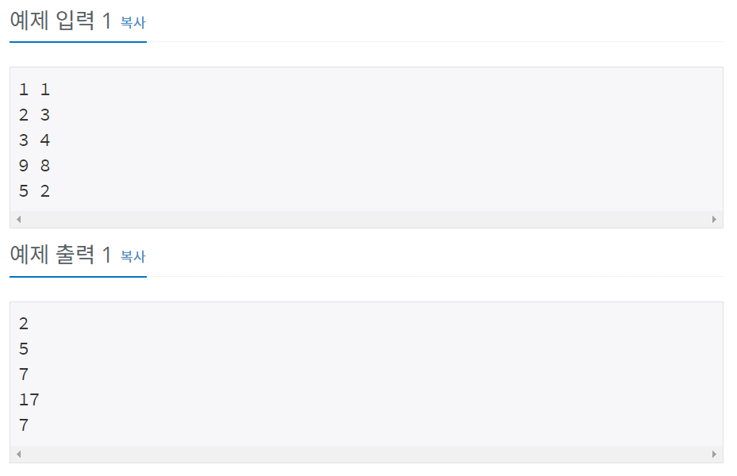

# 백준 10951번 파이썬


## 문제

두 정수 A와 B를 입력받은 다음, A+B를 출력하는 프로그램을 작성하시오.

## 입력

입력은 여러 개의 테스트 케이스로 이루어져 있다.

각 테스트 케이스는 한 줄로 이루어져 있으며, 각 줄에 A와 B가 주어진다. (0 < A, B < 10)


## 출력

각 테스트 케이스마다 A+B를 출력한다.


## 예제 입력




## **문제 풀이**

```python
while True:
	try :
		a,b = map(int, input(). split())
		print(a+b)
	except :
		break
```

갯수가 정해지지 않아서 try문이 에러가 발생할 경우 except에서 break로 while문을 멈춘다. 그 이외에는 입력하는 a, b의 값에 합을 출력한다.


