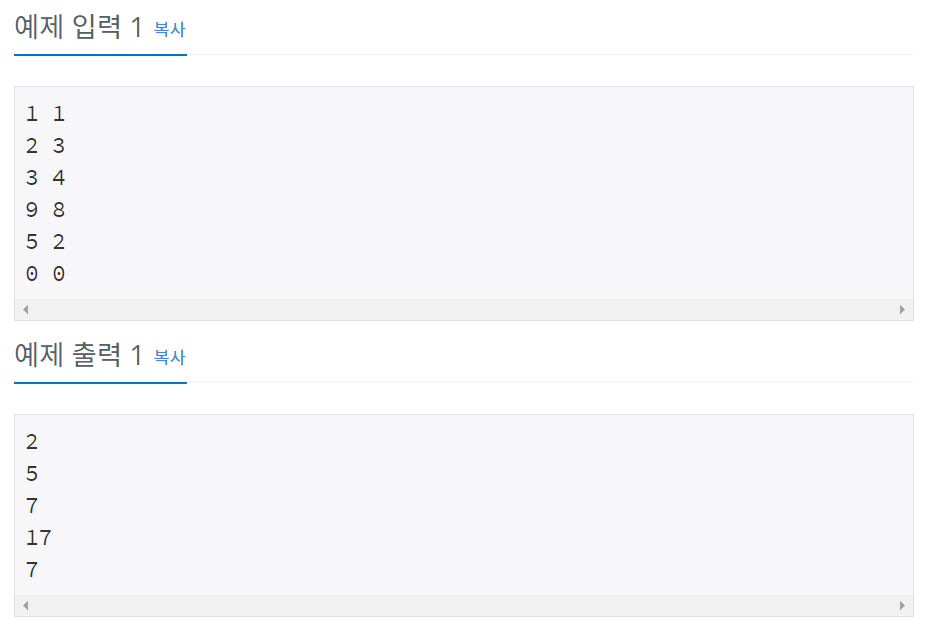

# 백준 10952번 파이썬


## 문제

두 정수 A와 B를 입력받은 다음, A+B를 출력하는 프로그램을 작성하시오.

## 입력

입력은 여러 개의 테스트 케이스로 이루어져 있다.

각 테스트 케이스는 한 줄로 이루어져 있으며, 각 줄에 A와 B가 주어진다. (0 < A, B < 10)

입력의 마지막에는 0 두 개가 들어온다.


## 출력

각 테스트 케이스마다 A+B를 출력한다.


## 예제 입력



## **문제 풀이**

```python
while True:
	a,b = map(int, input(). split())
	if (a==0 and b==0):
		break
	else :
		print(a+b)
```

while True로 무한 반복을 하면서 입력받고 a+b값을 출력하는데 a와 b가 모두 0일 경우에는 break문으로 종료한다.


